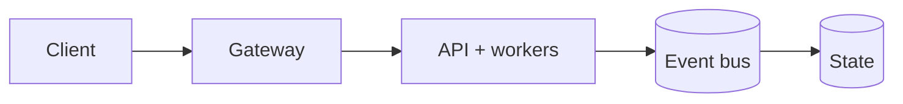

# DeepSequence Recommender

<p align="center"><strong>A versioned, evaluated sequential recommender with a reproducible training-to-serving contract.</strong></p>

<p align="center">
  <a href="https://github.com/CoreyLeath-code/DeepSequence-Recommender/actions/workflows/ci-cd.yml"></a>
  <a href="https://github.com/CoreyLeath-code/DeepSequence-Recommender/actions/workflows/ci.yml"></a>
  <a href="https://github.com/CoreyLeath-code/DeepSequence-Recommender/actions/workflows/security.yml"></a>
  <a href="https://github.com/CoreyLeath-code/DeepSequence-Recommender/actions/workflows/benchmarks.yml"></a>
  <a href="https://github.com/CoreyLeath-code/DeepSequence-Recommender/actions/workflows/data-validation.yml"></a>
</p>

<p align="center">
  
  
  
  
  
  

DeepSequence Recommender learns next-item behavior from timestamped interactions. One connected
path now covers schema validation, chronological splits, training, baseline comparison, model
packaging, checksum verification, serving, feedback capture, and monitoring.

The repository does **not** ship a trained production model or claim production availability.
Production fails closed unless a verified bundle is mounted. Development uses a deterministic
untrained model so API integration can be tested without presenting random ranking as AI quality.


## Production Readiness Guide

> This section is the portfolio audit entry point for **DeepSequence-Recommender**. It describes an engineering promotion path; it is not a claim that the repository is already production-authorized.

[](https://github.com/CoreyLeath-code/DeepSequence-Recommender/actions) [](https://github.com/CoreyLeath-code/DeepSequence-Recommender/blob/main/LICENSE)

### Architecture flowchart



### Quickstart and local validation

The supported local path should be reproducible from a clean checkout. The inferred stack for this repository is **Python/platform services**.

```bash
python -m venv .venv && source .venv/bin/activate && pip install -r requirements.txt
pytest -q
```

If the project uses external services, model artifacts, cloud credentials, or private data, start them through documented local fixtures or mocks. Never place secrets or identifiable records in the repository.

### Research-style metrics and benchmarks

| Evidence | Required record |
|---|---|
| Correctness | Test command, commit SHA, runtime, and pass/fail result |
| Performance | Warm-up, sample count, concurrency, median, p95, p99, throughput, and memory |
| Data/model quality | Dataset version, split strategy, leakage controls, calibration, subgroup results, and uncertainty |
| Runtime | Image digest, health-check latency, resource limits, and rollback target |
| Security | Dependency, secret, SAST, container, and SBOM results |

A benchmark number belongs in a versioned artifact tied to a commit and hardware/runtime description. Engineering benchmarks must not be presented as clinical, financial, safety, or model-quality validation without the appropriate domain evidence.

### Extended Q&A

**What is production-ready for this repository?**  
A reproducible build, tested public contract, controlled configuration, observable runtime, documented security boundary, versioned artifacts, and a tested rollback path.

**What must remain explicit?**  
The intended use, excluded use, data/credential handling, model or algorithm limitations, and which metrics are measured versus aspirational.

**What should be completed next?**  
Use the linked production-readiness issue for this repository as the checklist. Resolve missing tests, deployment instructions, observability, supply-chain controls, and release evidence before attaching a production claim.


## Engineering features

- Padding-aware attention, aligned item/output IDs, excluded padding class, and bounded top-k.
- Versioned events, temporal splits, causal targets, deterministic seeds, and popularity baseline.
- Recall@K, NDCG@K, MRR@K, catalogue coverage, and machine-readable evaluation reports.
- Immutable bundles containing weights, vocabulary, architecture, lineage, metrics, and checksums.
- Fail-closed production startup for absent, corrupted, or incompatible artifacts.
- API-key option, rate limiting, admission control, latency fallback, and version-aware caching.
- Privacy-minimized feedback events for impressions, clicks, skips, carts, purchases, and dislikes.
- Prometheus inference, request, cache, fallback, saturation, and feedback signals.
- Non-root/read-only container and hardened Kubernetes security/resource configuration.
- CI that cannot hide test, schema, audit, or benchmark failures with shell fallbacks.

## Architecture

```text
Events -> contract -> chronological split -> causal examples
  |                                           |
  |                              popularity baseline
  v                                           v
PyTorch training --------------------> ranking evaluation
  |
  v
manifest + vocabulary + weights + metrics + checksums
  |
  v
startup verification -> API key -> rate limit -> cache -> admission -> model
                                                           |          |
                                                           +-> fallback
                                                                  |
                                       Prometheus + feedback events
```

## Quick start

```bash
git clone https://github.com/CoreyLeath-code/DeepSequence-Recommender.git
cd DeepSequence-Recommender
python -m venv .venv
source .venv/bin/activate  # Windows: .venv\Scripts\activate
pip install -r requirements.txt
pip install pytest pytest-cov ruff
pytest -q
ENVIRONMENT=development uvicorn app.main:app --reload
```

Development responses identify the model as `development-untrained`.

## Train, evaluate, and package

```bash
python -m scripts.generate_demo_data --output data/demo-events.jsonl
python -m src.training.train \
  --dataset data/demo-events.jsonl \
  --output models/candidate \
  --epochs 3 \
  --top-k 10 \
  --seed 7
```

The candidate contains:

```text
manifest.json       version, architecture, dataset lineage, metrics, checksums
model.pt            PyTorch state dictionary
vocabulary.json     exact training/serving item mapping
evaluation.json     neural and popularity-baseline results
```

Demo data validates the pipeline only. Use a leakage-reviewed production snapshot before making
ranking claims. Promote the complete directory through the model registry; never mix files.

Export the exact verified model—not a mock architecture—to ONNX:

```bash
python -m src.serving.onnx_exporter --bundle models/current --output models/model.onnx
```

## Production serving

```bash
ENVIRONMENT=production \
MODEL_BUNDLE_PATH=models/current \
API_KEY='replace-me' \
uvicorn app.main:app --host 0.0.0.0 --port 8000
```

```bash
curl -X POST http://localhost:8000/recommendations/ \
  -H 'Content-Type: application/json' \
  -H 'X-API-Key: replace-me' \
  -d '{"user_id":"user-42","item_sequence":["item-2","item-7"],"top_k":5}'
```

Feedback is accepted at `POST /recommendations/feedback`. Raw user IDs are hashed before events
are logged. Production should route structured logs to a governed event bus with retention,
consent, deletion, and delivery guarantees.


| Concern | Decision | Tradeoff / boundary |
|---|---|---|
| Training-serving parity | One vocabulary and architecture manifest drives serving and ONNX | Bundle migrations need explicit compatibility handling |
| Leakage | Global chronological split and causal prefix targets | Production also needs cold-start and cohort evaluation |
| Promotion | Neural NDCG is compared with popularity | Registry automation remains deployment-specific |
| Integrity | SHA-256 plus strict state-dict loading | Add KMS/Sigstore for signed provenance |
| Overload | Non-blocking admission and deterministic fallback | Hard cancellation needs a worker/model-server boundary |
| Cache | Key includes model version, history, and top-k | In-memory state is replica-local |
| Rate limit | Per-process fixed window | Authoritative distributed limits belong at the gateway |
| Authentication | Constant-time optional API key | Multi-tenant systems need workload identity/OAuth and policy |
| Feedback | Pseudonymized structured events | Event bus, retention, and deletion are platform integrations |
| Kubernetes | Immutable tag, read-only FS, non-root, seccomp, resource bounds | Registry, secrets, PVC, and rollout controller are external |

## Research metrics and benchmarks

Every real candidate reports Recall@K, NDCG@K, MRR@K, and coverage beside popularity. No quality
number is published here because a representative production dataset is not included.

Reference systems microbenchmark:

```bash
python -m benchmarks.inference --iterations 200 --warmup 20
```

| Metric | Observation |
|---|---:|
| Mean | 0.573 ms |
| p50 | 0.556 ms |
| p95 | 0.755 ms |
| p99 | 1.118 ms |
| Sequential rate | 1,743.0 inferences/s |

Environment: Python 3.12.13, PyTorch 2.13.0 CPU, Windows 11 build 26200, AMD64 Family 25 Model
97; batch 1, 500 items, padded length 50, top-k 10, 20 warmups, 200 measured samples, collected
July 22, 2026.

This excludes HTTP, serialization, queueing, network, concurrency, replicas, cold starts, and
real catalogue scale. It is a regression baseline—not a production SLO or availability claim.
See [benchmark methodology](docs/BENCHMARKS.md).

## Production-readiness status

- [x] Correct ranking IDs and padding behavior
- [x] Strict request and event contracts
- [x] Temporal evaluation and baseline comparison
- [x] Versioned checksummed model bundle
- [x] Fail-closed production loading and model readiness
- [x] Admission, fallback, cache, rate limit, and API-key option
- [x] Feedback contract and user-ID minimization
- [x] Enforced CI, schema, security, and benchmark evidence
- [x] Hardened container and Kubernetes manifests
- [ ] Governed representative production dataset
- [ ] External registry, signed provenance, and automated promotion
- [ ] Distributed gateway limits and durable event bus
- [ ] Target-environment multi-replica load test
- [ ] Shadow/canary rollout with automated rollback
- [ ] Online experiment proving user or business impact

Unchecked items require real data or deployment infrastructure and cannot be honestly completed
inside a standalone public repository.

## Extended recruiter Q&A

### Is this genuinely AI-powered?

Yes when a trained bundle is supplied. It trains a bidirectional LSTM with padding-aware attention
on causal next-item examples. Production cannot silently substitute random weights.

### Why was the old demo not production AI?

A neural class with random weights is not learned recommendation. Production requires data,
evaluation, lineage, versioned artifacts, readiness, rollback, and operational evidence.

### Why use a popularity baseline?

A complex model should earn its cost. Popularity is cheap and often strong; a neural candidate
that cannot beat it on leakage-safe ranking metrics should not be promoted.

### Why split chronologically?

Random splits leak future behavior. Chronological evaluation asks the real question: can the model
rank behavior that occurs later than its training evidence?

### Why package vocabulary with weights?

Embedding rows and output classes only mean something under the exact training mapping. A different
mapping can return plausible but incorrect item IDs without producing a tensor shape error.

### Why verify checksums?

Models are usually deployed outside Git. Checksums detect partial uploads, accidental bundle
mixing, and corruption. Signing/provenance is the next layer for regulated environments.

### Why retain a development model?

It keeps smoke tests self-contained. It is seeded, visibly labeled untrained, and forbidden in
production, so convenience cannot become an invisible ranking failure.

### Is the latency fallback a hard timeout?

No. It replaces a result after an in-process kernel finishes. Hard cancellation requires a process
or model-server boundary with load shedding and cancelable requests.

### Why not use an LLM as the ranker?

LLMs help with intent, catalogue enrichment, and grounded explanations. Core ranking still needs
measurable retrieval, temporal evaluation, deterministic policy, and controlled cost.

### How would this scale to millions of items?

Use a two-stage system: two-tower/ANN candidate retrieval followed by sequence re-ranking. A dense
projection over the entire catalogue is not economical at very large scale.

### How would you handle cold start?

Initialize new items from text/image/category embeddings and use contextual popularity until
behavior accumulates. Report new-user and new-item cohorts separately.

### What should be monitored?

Latency, errors, saturation, cache/fallback rates, model version, unknown-item rate, feature and
prediction drift, delayed-label ranking quality, coverage, diversity, bias, and experiment goals.

### What is the rollout strategy?

Shadow first, compare outputs/resources, canary a small percentage, enforce guardrails, then ramp
with automatic rollback to the previous immutable image-and-bundle pair.

### What demonstrates senior engineering here?

The model is treated as one component. Data contracts, evaluation, lineage, serving safety,
privacy, observability, delivery, and honest claims form the production system around it.

## Documentation

- [Benchmark methodology](docs/BENCHMARKS.md)
- [Model card](docs/MODEL_CARD.md)
- [Operations runbook](docs/OPERATIONS.md)
- [Privacy policy](docs/PRIVACY…4021 tokens truncated…Scaled dot-product self-attention over LSTM hidden states."""

    def __init__(self, hidden_dim: int) -> None:
        super().__init__()
        self.attn = nn.Linear(hidden_dim * 2, 1)

    def forward(self, lstm_out: torch.Tensor, mask: torch.Tensor) -> torch.Tensor:
        # lstm_out: (batch, seq_len, hidden_dim*2)
        scores = self.attn(lstm_out).squeeze(-1)  # (batch, seq_len)
        scores = scores.masked_fill(~mask, -1e9)
        weights = F.softmax(scores, dim=-1) * mask
        weights = weights / weights.sum(dim=-1, keepdim=True).clamp_min(1e-9)
        weights = weights.unsqueeze(-1)  # (batch, seq_len, 1)
        context = (lstm_out * weights).sum(dim=1)  # (batch, hidden_dim*2)
        return context


class DeepSequenceModel(nn.Module):
    """Bidirectional LSTM + attention sequence recommender."""

    def __init__(
        self,
        num_items: int,
        embedding_dim: int = 64,
        hidden_dim: int = 128,
        num_layers: int = 2,
        dropout: float = 0.3,
        padding_idx: int = 0,
    ) -> None:
        super().__init__()
        self.embedding = nn.Embedding(num_items + 1, embedding_dim, padding_idx=padding_idx)
        self.lstm = nn.LSTM(
            input_size=embedding_dim,
            hidden_size=hidden_dim,
            num_layers=num_layers,
            batch_first=True,
            bidirectional=True,
            dropout=dropout if num_layers > 1 else 0.0,
        )
        self.attention = AttentionLayer(hidden_dim)
        self.dropout = nn.Dropout(dropout)
        self.num_items = num_items
        self.padding_idx = padding_idx
        self.output_proj = nn.Linear(hidden_dim * 2, num_items + 1)

    def forward(self, item_seq: torch.Tensor) -> torch.Tensor:
        """Return logits over the item catalogue.

        Parameters
        ----------
        item_seq:
            LongTensor of shape ``(batch_size, seq_len)`` containing item IDs.

        Returns
        -------
        torch.Tensor
            Logit tensor of shape ``(batch_size, num_items + 1)``. Index zero
            is reserved for padding and is never eligible for recommendation.
        """
        emb = self.dropout(self.embedding(item_seq))  # (B, L, E)
        lstm_out, _ = self.lstm(emb)  # (B, L, H*2)
        mask = item_seq.ne(self.padding_idx)
        context = self.attention(lstm_out, mask)  # (B, H*2)
        logits = self.output_proj(self.dropout(context))  # (B, num_items + 1)
        logits[:, self.padding_idx] = float("-inf")
        return logits

    @torch.no_grad()
    def recommend(
        self,
        item_seq: torch.Tensor,
        top_k: int = 10,
        exclude_ids: list[int] | None = None,
    ) -> list[int]:
        """Return top-k recommended item IDs for a single sequence."""
        self.eval()
        if item_seq.ndim != 2 or not item_seq.ne(self.padding_idx).any():
            raise ValueError("A recommendation requires at least one known item")
        if not 1 <= top_k <= self.num_items:
            raise ValueError(f"top_k must be between 1 and {self.num_items}")
        excluded = {idx for idx in (exclude_ids or []) if 1 <= idx <= self.num_items}
        if top_k > self.num_items - len(excluded):
            raise ValueError("top_k exceeds the remaining eligible catalogue")
        logits = self.forward(item_seq)
        for idx in excluded:
            logits[:, idx] = float("-inf")
        scores = torch.topk(logits, k=top_k, dim=-1)
        return scores.indices[0].tolist()
