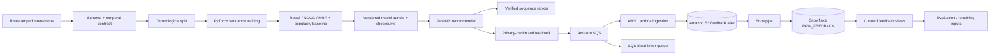

# DeepSequence Recommender

<p align="center"><strong>A versioned, evaluated sequential recommender with a reproducible training-to-serving contract and an optional AWS-to-Snowflake feedback path.</strong></p>

<p align="center">
  <a href="https://github.com/CoreyLeath-code/DeepSequence-Recommender/actions/workflows/ci-cd.yml"></a>
  <a href="https://github.com/CoreyLeath-code/DeepSequence-Recommender/actions/workflows/ci.yml"></a>
  <a href="https://github.com/CoreyLeath-code/DeepSequence-Recommender/actions/workflows/security.yml"></a>
  <a href="https://github.com/CoreyLeath-code/DeepSequence-Recommender/actions/workflows/benchmarks.yml"></a>
  <a href="https://github.com/CoreyLeath-code/DeepSequence-Recommender/actions/workflows/data-validation.yml"></a>
  <a href="https://github.com/CoreyLeath-code/DeepSequence-Recommender/actions/workflows/aws-snowflake-validation.yml"></a>
</p>

<p align="center">
  
  
  
  
  
  
</p>

DeepSequence Recommender learns next-item behavior from timestamped interactions. The repository covers schema validation, chronological splitting, causal training examples, baseline comparison, model packaging, checksum verification, serving, feedback capture, observability, container/Kubernetes delivery, and a credential-free validated AWS/Snowflake integration contract.

The repository does **not** ship a representative production dataset or claim production availability, cloud-scale throughput, Lambda latency, Snowpipe freshness, Snowflake cost, or business impact. Production serving fails closed unless a verified model bundle is mounted. Cloud evidence remains explicitly `not_run` until an authorized environment executes the integration.

## Architecture


```mermaid
flowchart LR
    Events[Timestamped interactions] --> Contract[Schema + temporal contract]
    Contract --> Split[Chronological split]
    Split --> Train[PyTorch sequence training]
    Train --> Eval[Recall / NDCG / MRR + popularity baseline]
    Eval --> Bundle[Versioned model bundle + checksums]
    Bundle --> API[FastAPI recommender]
    API --> Model[Verified sequence ranker]
    API --> Feedback[Privacy-minimized feedback]
    Feedback --> SQS[Amazon SQS]
    SQS --> Lambda[AWS Lambda ingestion]
    SQS --> DLQ[SQS dead-letter queue]
    Lambda --> S3[(Amazon S3 feedback lake)]
    S3 --> Snowpipe[Snowpipe]
    Snowpipe --> Raw[(Snowflake RAW_FEEDBACK)]
    Raw --> Curated[Curated feedback views]
    Curated --> Offline[Evaluation / retraining inputs]
```

The AWS/Snowflake path **augments** the existing FastAPI/Kubernetes serving architecture. Lambda is used for asynchronous feedback ingestion, not as a replacement for the model-serving process.

## Evidence status

| Capability | Status | Evidence boundary |
|---|---|---|
| Training/evaluation contract | Implemented and locally testable | Demo data validates mechanics, not production ranking quality |
| Verified model bundle | Implemented | Production fails closed on missing/corrupt/incompatible artifacts |
| FastAPI inference controls | Implemented | In-process controls are not a distributed gateway |
| Docker/Kubernetes delivery | Implemented | Target-environment rollout evidence is still required |
| SQS → Lambda → S3 feedback path | Implemented and credential-free validated | Real AWS deployment metrics are `not_run` |
| Snowflake raw/curated schema | Implemented as SQL assets | Real account execution is `not_run` |
| Snowpipe ingestion contract | Implemented as account-parameterized template | Notification/IAM trust handshake is deployment-specific |
| Cloud latency/cost/freshness | Not measured | See `evidence/aws-snowflake-feedback-results.json` |
| Online business impact | Not measured | Requires a governed experiment and representative traffic |

## Engineering features

- Padding-aware sequence encoding, aligned item/output IDs, excluded padding class, and bounded top-k.
- Versioned interaction events, chronological splits, causal prefix targets, deterministic seeds, and a popularity baseline.
- Recall@K, NDCG@K, MRR@K, catalogue coverage, and machine-readable evaluation reports.
- Immutable model bundles containing weights, vocabulary, architecture, lineage, metrics, and SHA-256 checksums.
- Fail-closed production startup for absent, corrupted, or incompatible artifacts.
- API-key option, rate limiting, admission control, latency fallback, and version-aware caching.
- Privacy-minimized feedback events for impressions, clicks, skips, carts, purchases, and dislikes.
- Optional Amazon SQS feedback delivery with a local structured-log fallback for credential-free development.
- SQS-triggered AWS Lambda ingestion with schema validation, direct-PII rejection, partial-batch failure handling, and deterministic S3 keys for retry-safe landing.
- Encrypted SQS/DLQ and S3 infrastructure, CloudWatch log retention, and least-privilege IAM implemented in Terraform.
- Snowflake raw `VARIANT` landing table, curated recommendation-feedback view, daily model-feedback view, and Snowpipe template.
- Prometheus inference, request, cache, fallback, saturation, and feedback metrics.
- Non-root/read-only container and hardened Kubernetes security/resource configuration.
- CI that validates tests, schemas, security, benchmarks, AWS/Snowflake contracts, and Terraform without requiring cloud credentials.

## Quick start

```bash
git clone https://github.com/CoreyLeath-code/DeepSequence-Recommender.git
cd DeepSequence-Recommender
python -m venv .venv
source .venv/bin/activate  # Windows: .venv\Scripts\activate
pip install -r requirements.txt
pip install -r requirements-dev.txt
pytest -q
ENVIRONMENT=development uvicorn app.main:app --reload
```

Development responses identify the model as `development-untrained`. When `FEEDBACK_QUEUE_URL` is unset, feedback uses privacy-minimized structured logs, so local smoke tests do not need AWS credentials.

## Train, evaluate, and package

```bash
python -m scripts.generate_demo_data --output data/demo-events.jsonl
python -m src.training.train \
  --dataset data/demo-events.jsonl \
  --output models/candidate \
  --epochs 3 \
  --top-k 10 \
  --seed 7
```

A candidate bundle contains:

```text
manifest.json       version, architecture, dataset lineage, metrics, checksums
model.pt            PyTorch state dictionary
vocabulary.json     exact training/serving item mapping
evaluation.json     neural and popularity-baseline results
```

Demo data validates the pipeline only. Use a leakage-reviewed representative snapshot before making ranking-quality claims. Promote the complete directory through the model registry; never mix files from different bundles.

Export the exact verified model to ONNX:

```bash
python -m src.serving.onnx_exporter --bundle models/current --output models/model.onnx
```

## Production serving

```bash
ENVIRONMENT=production \
MODEL_BUNDLE_PATH=models/current \
API_KEY='replace-me' \
uvicorn app.main:app --host 0.0.0.0 --port 8000
```

In production, `API_KEY` is mandatory. When it is unset, recommendation and feedback requests return HTTP 503 rather than silently exposing unauthenticated endpoints.

```bash
curl -X POST http://localhost:8000/recommendations/ \
  -H 'Content-Type: application/json' \
  -H 'X-API-Key: replace-me' \
  -d '{"user_id":"user-42","item_sequence":["item-2","item-7"],"top_k":5}'
```

Feedback is accepted at `POST /recommendations/feedback`. The raw user ID is removed before delivery and replaced with a truncated SHA-256 pseudonym. Hashing is minimization, not anonymization; production operators still need retention, consent, deletion, access-control, and regional-processing policies.

## AWS Lambda + Snowflake feedback pipeline

Deploy the AWS development stack with Terraform:

```bash
terraform -chdir=infra/aws init
terraform -chdir=infra/aws plan
terraform -chdir=infra/aws apply
terraform -chdir=infra/aws output -raw feedback_queue_url
terraform -chdir=infra/aws output -raw feedback_bucket
```

Attach the emitted `feedback_publisher_policy_arn` to the API workload identity, then set `FEEDBACK_QUEUE_URL` and `AWS_REGION` for the recommender process.

The Lambda lands one normalized event per SQS message under:

```text
feedback/event_date=YYYY-MM-DD/hour=HH/message_id=<sqs-message-id>.json
```

Snowflake setup is intentionally split from AWS deployment because a storage integration requires an account-specific IAM trust handshake. Run `snowflake/sql/001_feedback_schema.sql`, then configure `snowflake/sql/002_snowpipe.template.sql` with the deployed bucket and Snowflake storage role. Full instructions are in [AWS Lambda + Snowflake feedback pipeline](docs/AWS_SNOWFLAKE_PIPELINE.md).

Credential-free validation:

```bash
pytest -q tests/test_aws_snowflake_feedback.py
python scripts/validate_aws_snowflake_assets.py
terraform -chdir=infra/aws init -backend=false
terraform -chdir=infra/aws validate
```

## System-design decisions

| Concern | Decision | Tradeoff / boundary |
|---|---|---|
| Training-serving parity | One vocabulary and architecture manifest drives serving and ONNX | Bundle migrations need explicit compatibility handling |
| Leakage | Global chronological split and causal prefix targets | Production also needs cold-start and cohort evaluation |
| Promotion | Neural NDCG is compared with popularity | Registry automation remains deployment-specific |
| Integrity | SHA-256 plus strict state-dict loading | Add KMS/Sigstore for signed provenance |
| Overload | Non-blocking admission and deterministic fallback | Hard cancellation needs a worker/model-server boundary |
| Cache | Key includes model version, history, and top-k | In-memory state is replica-local |
| Rate limit | Per-process fixed window | Authoritative distributed limits belong at the gateway |
| Authentication | Constant-time API-key option | Multi-tenant systems need workload identity/OAuth and policy |
| Feedback delivery | SQS decouples request serving from offline analytics | Requires workload IAM and queue operations |
| Lambda role | Async validation/landing, not model inference | Avoids cold-start/model-size coupling with online ranking |
| S3 layer | Replayable, auditable raw-event boundary | More components than a direct DB write |
| Snowflake | Raw `VARIANT` plus curated views and Snowpipe | Storage integration/IAM handshake is account-specific |
| Kubernetes | Immutable image, read-only FS, non-root, seccomp, resource bounds | Registry, secrets, PVC, and rollout controller are external |

## Research metrics and benchmarks

Every real candidate reports Recall@K, NDCG@K, MRR@K, and coverage beside popularity. No representative production-quality number is published because a production dataset is not included.

Reference systems microbenchmark:

```bash
python -m benchmarks.inference --iterations 200 --warmup 20
```

| Metric | Observation |
|---|---:|
| Mean | 0.573 ms |
| p50 | 0.556 ms |
| p95 | 0.755 ms |
| p99 | 1.118 ms |
| Sequential rate | 1,743.0 inferences/s |

Environment: Python 3.12.13, PyTorch 2.13.0 CPU, Windows 11 build 26200, AMD64 Family 25 Model 97; batch 1, 500 items, padded length 50, top-k 10, 20 warmups, 200 measured samples, collected July 22, 2026.

This excludes HTTP, serialization, queueing, network, concurrency, replicas, cold starts, AWS Lambda, Snowpipe, Snowflake, and real catalogue scale. It is a regression baseline—not a production SLO or availability claim. See [benchmark methodology](docs/BENCHMARKS.md).

## Production-readiness status

- [x] Correct ranking IDs and padding behavior
- [x] Strict request and event contracts
- [x] Temporal evaluation and baseline comparison
- [x] Versioned checksummed model bundle
- [x] Fail-closed production loading and model readiness
- [x] Admission, fallback, cache, rate limit, and API-key option
- [x] Feedback contract and user-ID minimization
- [x] SQS → Lambda → S3 feedback infrastructure and contract tests
- [x] Snowflake raw/curated schema and Snowpipe integration template
- [x] Credential-free AWS/Snowflake CI validation
- [x] Enforced CI, schema, security, and benchmark evidence
- [x] Hardened container and Kubernetes manifests
- [ ] Authorized AWS deployment evidence
- [ ] Authorized Snowflake/Snowpipe load evidence
- [ ] Governed representative production dataset
- [ ] External registry, signed provenance, and automated promotion
- [ ] Distributed gateway limits
- [ ] Target-environment multi-replica load test
- [ ] Shadow/canary rollout with automated rollback
- [ ] Online experiment proving user or business impact

Unchecked items require real data, cloud accounts, deployment infrastructure, or governed experiments and cannot be honestly completed by static repository code alone.

## Recruiter / design Q&A

### Why use Lambda here instead of serving the model in Lambda?

The model-serving path already has explicit bundle verification, admission control, caching, fallback behavior, and Kubernetes deployment controls. Lambda is a better fit for bursty asynchronous feedback ingestion, where SQS retries and partial-batch handling add resilience without coupling online ranking latency to warehouse delivery.

### Why S3 before Snowflake instead of writing directly from Lambda?

S3 creates a replayable raw-event boundary. If warehouse credentials, Snowpipe configuration, or downstream schema logic changes, the source events remain available for controlled reprocessing. It also keeps Snowflake credentials out of the Lambda runtime.

### Why Snowflake?

Recommendation quality and product impact require more than inference logs. A warehouse makes model-version cohorts, impressions, clicks, carts, purchases, dislikes, delayed outcomes, and experiment analysis queryable through governed tables and views.

### Is the AWS/Snowflake path production-proven?

No. The code, Terraform, contracts, SQL, documentation, and credential-free validation are implemented. `evidence/aws-snowflake-feedback-results.json` remains `not_run` until an authorized cloud environment measures deployment behavior.

### Why use a popularity baseline?

A complex model should earn its cost. A neural candidate that cannot beat a simple popularity baseline on leakage-safe ranking metrics should not be promoted.

### How would this scale to millions of items?

Use a two-stage architecture: ANN/two-tower candidate retrieval followed by sequence-aware re-ranking. A dense projection over the entire catalogue is not economical at very large scale.

### What should be monitored?

Latency, errors, saturation, cache/fallback rates, model version, unknown-item rate, feature/prediction drift, delayed-label ranking quality, Lambda errors/duration, SQS age/DLQ depth, Snowpipe load lag, coverage, diversity, and experiment goals.

## Documentation

- [AWS Lambda + Snowflake feedback pipeline](docs/AWS_SNOWFLAKE_PIPELINE.md)
- [Benchmark methodology](docs/BENCHMARKS.md)
- [Model card](docs/MODEL_CARD.md)
- [Operations runbook](docs/OPERATIONS.md)
- [Privacy policy](docs/PRIVACY.md)
- [Architecture](docs/architecture.md)
- [Metrics](docs/metrics.md)

## License

MIT. See [LICENSE](LICENSE).
