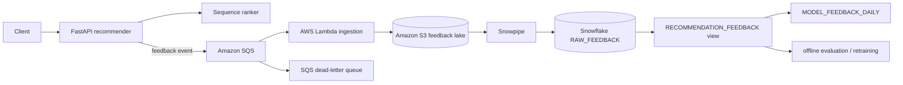

# AWS Lambda + Snowflake feedback pipeline

This integration adds a durable, optional feedback path without replacing the existing FastAPI/Kubernetes inference service. Local development remains self-contained: when `FEEDBACK_QUEUE_URL` is unset, accepted feedback is emitted as a privacy-minimized structured log. When the queue is configured, the API publishes the same versioned event to Amazon SQS.

## Architecture



## Event contract

The API emits schema version `1` with an opaque `event_id`, impression/item/model identifiers, event type, position, UTC timestamp, and a truncated SHA-256 pseudonym. The raw `user_id` is removed before delivery. The Lambda validates the schema again and rejects common direct-PII field names before writing to S3.

Each SQS message becomes one idempotent S3 object keyed by the SQS `messageId` under:

```text
feedback/event_date=YYYY-MM-DD/hour=HH/message_id=<id>.json
```

Retries therefore overwrite the same logical object instead of creating duplicate files for the same SQS message. The Lambda returns SQS partial-batch failures so one malformed event does not cause successfully landed records to be retried.

## Deploy the AWS development stack

Prerequisites: Terraform 1.6+, an authenticated AWS CLI/session, and permission to create IAM, Lambda, SQS, S3, and CloudWatch resources.

```bash
cd infra/aws
terraform init
terraform plan
terraform apply
terraform output -raw feedback_queue_url
terraform output -raw feedback_bucket
terraform output -raw feedback_publisher_policy_arn
```

Attach the emitted publisher policy to the API workload identity, then set:

```bash
export FEEDBACK_QUEUE_URL="$(terraform -chdir=infra/aws output -raw feedback_queue_url)"
export AWS_REGION="us-east-1"
```

The Terraform stack creates encrypted SQS queues, a dead-letter queue, an encrypted/versioned/private S3 bucket, a least-privilege Lambda role, CloudWatch log retention, the Lambda event-source mapping, and a separate least-privilege policy for API `sqs:SendMessage` access.

## Configure Snowflake

Run `snowflake/sql/001_feedback_schema.sql` first. It creates the raw `VARIANT` landing table plus curated feedback and daily model-feedback views.

Snowflake storage integrations require a two-sided IAM trust handshake. Create or select an AWS IAM role that can read only the generated bucket/prefix, then render `snowflake/sql/002_snowpipe.template.sql` by replacing `<AWS_ROLE_ARN>` and `<S3_BUCKET>`. After `CREATE STORAGE INTEGRATION`, use `DESC INTEGRATION DEEPSEQUENCE_S3_INTEGRATION` to obtain Snowflake's IAM user ARN and external ID and lock the AWS role trust policy to those values.

After `CREATE PIPE`, run:

```sql
SHOW PIPES LIKE 'FEEDBACK_PIPE' IN SCHEMA DEEPSEQUENCE_ANALYTICS.RECOMMENDER;
```

Configure the returned `notification_channel` as the S3 object-created notification target for the `feedback/` prefix. That final account-specific wiring is intentionally not hard-coded in this public repository.

## Offline validation

No AWS or Snowflake credentials are required for the PR validation path:

```bash
pytest -q tests/test_aws_snowflake_feedback.py
ruff check app/core/feedback_sink.py serverless/feedback_ingestion tests/test_aws_snowflake_feedback.py
python scripts/validate_aws_snowflake_assets.py
terraform -chdir=infra/aws init -backend=false
terraform -chdir=infra/aws validate
```

## Evidence boundary

`evidence/aws-snowflake-feedback-results.json` remains `not_run` until an authorized AWS deployment and Snowflake account execute the path. The repository therefore claims implementation and credential-free validation only; it does not claim measured Lambda latency, Snowpipe freshness, Snowflake throughput, cloud cost, availability, or business lift.
