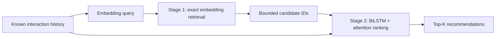
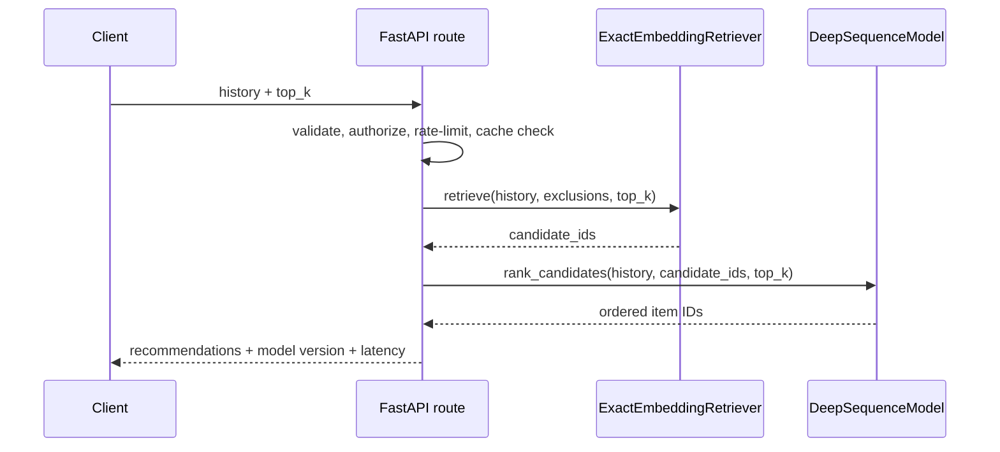

# Architecture Walkthrough: Two-Stage Serving

This is an 8-minute walkthrough script and diagram set for the current implementation. It describes
the code in this repository; it does not claim that an ANN index, external feature store, or runtime
reasoning service exists.

## 0:00–1:00 — Problem and decision

The original serving path applied the sequence model's dense output projection to every catalogue
item. That is simple and correct for the current small bundle, but its work grows with catalogue
size and provides no replaceable candidate boundary. The two-stage design separates *recall*
from *precision*: retrieval produces a bounded set of plausible item IDs, then ranking spends the
sequence model's richer scoring capacity only on that set.

## 1:00–3:00 — Retrieval is not ranking

`app/core/retrieval.py` implements `ExactEmbeddingRetriever`. It averages embeddings of known
history items, normalizes that query, compares it with normalized catalogue embeddings, excludes
items already seen, and returns a bounded candidate list. Its default is an exact in-memory vector
scan. That makes behavior reproducible and keeps model bundles self-contained, but it is **not**
FAISS, HNSW, or another approximate-nearest-neighbor index.

Retrieval optimizes candidate recall and cost. It can return items that are semantically or
behaviorally near the history, but it has no access to the full sequence-ordering signal used by
the ranker. The stable `RetrievalResult` contract is the seam where an ANN implementation can
later be added after index lifecycle, recall, freshness, and operational evidence are available.

## 3:00–5:00 — Candidate-only ranking

`DeepSequenceModel.rank_candidates` runs the existing padding-aware bidirectional LSTM and
attention model, then gathers scores only for the retrieved IDs. This preserves the existing model
and training compatibility while making the ranking stage explicit. The API uses retrieval after
admission control and before decoding recommendations; cache, authentication, rate limits, and
fallback behavior remain unchanged.

The tradeoff is intentional: the first stage is logically separated but still scans all embeddings,
so it does not yet deliver the latency or memory profile of a production ANN system. Candidate-pool
size is configurable with `RETRIEVAL_CANDIDATE_POOL_SIZE`; it should be measured against
Recall@K and latency before changing it in production.

## 5:00–6:30 — Reasoning and explanations

No runtime `reasoning/` package or per-recommendation explanation endpoint exists in the current
repository. That is deliberate in this walkthrough: an LSTM score is not a causal explanation, and
the service should not invent a user-facing reason from hidden states. Issue #16 records the
separate evidence-backed explanation contract, including privacy review and insufficient-history
handling. Until that work is implemented and tested, the only trustworthy response-level evidence
is model version, fallback state, cache state, and bounded request latency.

## 6:30–8:00 — Engineering tradeoffs and next decisions

- **Exact retrieval now:** easy to test and bundle; unsuitable for large catalogues without an ANN
  index and index-refresh lifecycle.
- **Sequence ranker retained:** preserves current training artifacts; a future ranker change needs
  temporal evaluation against the popularity baseline.
- **No fabricated confidence:** offline ranking quality and per-recommendation confidence are
  different measurements.
- **No hidden reasoning:** user-facing explanations must be constrained to permitted evidence,
  not chain-of-thought or unvalidated causal language.
- **Safety preserved:** existing authentication, credential-derived rate limiting, admission
  control, cache keying, fallback, and model-bundle checks remain the API boundary.

Before a large-catalogue deployment, add an evaluated ANN backend, version and validate its index
with the model bundle, measure candidate recall and end-to-end p95/p99 latency, and keep the
candidate-ranker contract stable during rollout.
